# Juge-tron

# Tabla de contenidos
<li>
<a href="#whatis"> ¿Qué es este proyecto? </a>
</li>

<li>
<a href="#req"> Requerimientos </a>
</li>

<li>
<a href="#docu"> Documentación </a>
</li>

<li>
<a href="#howtouse"> Cómo ejecutar la simulación </a>
</li>

<li>
<a href="#design" id="#design"> Diseño del robot </a>
 <ul>
  <li>
   <a href="#components"> Componentes </a>
  </li>
  <li>
   <a href="#esq3d"> Esquema 3D </a>
  </li>
  <li>
   <a href="#esqHW"> Esquema Hardware </a>
  </li> 
 </ul>
</li>

<li>
<a href="#software"> Arquitectura Software </a>
 <ul>
  <li>
  <a href="#VC"> Visión por computador </a>
  </li>
  <ul>
   <li>
    <a href="#detectObst"> Detector de obstáculos </a>
   </li>
   <li>
    <a href="#detectorConcr"> Detector concreto </a>
   </li>
   </ul>
  </ul>
 <ul>
 <li>
  <a href="#pathpl"> Path-Planning </a>
 </li>
 <li>
  <a href="#otrosSens"> Otros Sensores </a>
 </li>
 <li>
  <a href="#calcMov"> Cálculo de movimiento </a>
 </li>
 <li>
  <a href="#arduino"> Arduino </a>
 </li>
 </ul>
</li>

<li>
<a href="#sim"> Simulación </a>
</li>

<li>
<a href="#autores"> Autores </a>
</li>


<div id='whatis'/>

##  ¿Qué es este proyecto?
Este es el repositorio de un proyecto que trata de un robot en forma de bola que tiene como función jugar con las mascotas huyendo de ellas. Para realizar este propósito, el robot contará con una cámara con la cual, a través de visión por computador, será capaz de visualizar al animal y su entorno para así poder actuar con cierta personalidad. 
El robot se moverá debido a la fricción ejercida por unas ruedas internas contra la carcasa de la bola, y los elementos del interior se mantendrán estables debido a un peso que ejercerá de centro de masas.


<div id='req'/>

## Requerimientos
Para ejecutar la simulación hacen falta las siguientes dependencias de python:
```
pip install numpy, opencv-python, tensorflow
```
También se requiere tener instalado el simulador Webots. 
 
<div id='docu'/>

## Documentación
Los siguientes proyectos han servido como referencia e inspiración:
https://www.hindawi.com/journals/complexity/2019/7543969/
https://www.sciencedirect.com/science/article/pii/S0307904X14006015
https://github.com/tensorflow/models/blob/master/research/object_detection/colab_tutorials/object_detection_tutorial.ipynb
https://nanonets.com/blog/optical-flow/


<div id='howtouse'/>

## Cómo ejecutar la simulación
1. Clonar el repositorio
2. Instalar PyTorch desde https://pytorch.org/, elegir CUDA 11.1 o mayor si se desea utilizar la GPU. 
3. Instalar las siguientes dependencias
```
pip install -U --pre tensorflow=="2.*"
pip install tf_slim
pip install -r requirements.txt
```
4. Dirigirse a la carpeta "/Reconocimiento de imágenes" y ejecutar los siguientes comandos:

``` 
powershell
cd research/
protoc object_detection/protos/*.proto --python_out=.
pip install .
```
5. Abrir haciendo doble click uno de los escenarios presentes en /RLP_Sim/worlds

<div id='design'/>

## Diseño del robot 

En esta carpeta se incluye el diseño que tendrá el robot.

<div id='components'/>

### Componentes
Los componentes Hardware utilizados serán los siguientes:

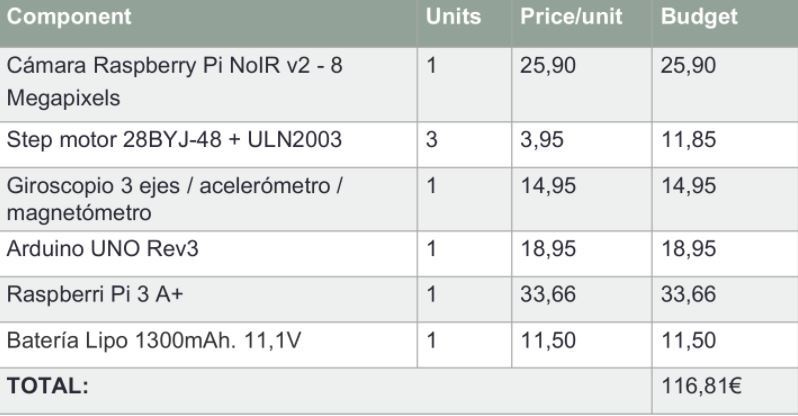

El tamaño de cada componente se incluye en la siguiente tabla:

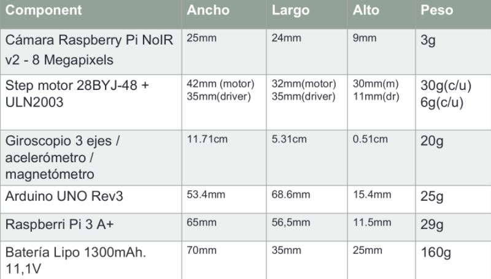

<div id='esq3D'/>

### Esquema 3D
El esquema básico dentro de la bola se compone de una base cilíndrica, sobre la que se colocarán los componentes hardware necesarios, tres ruedas que harán girar la carcasa de la bola mediante la fricción que ejerzan sobre ella, y tres varitas que unan las ruedas a la base. Este esquema se muestra en la siguiente imagen:

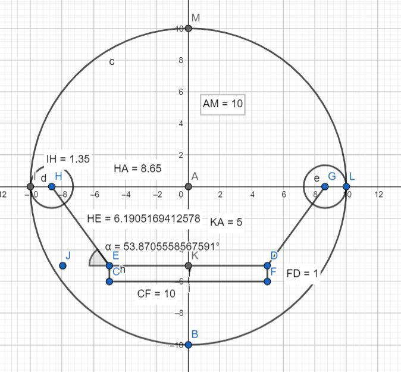

las piezas aquí mostradas se obtendrán mediante impresión 3D. Las medidas, colocación y ángulos relevantes de estas se indican en el esquema. El diseño 3D de las varitas incluye un pequeño soporte para poder pegarlas a la base con pegamento, un espacio para poder colocar las ruedas, y un agujero con una pieza que permite fijar las ruedas a la varita.

Debajo de la base se pegará un cilindro. Contendrá un peso que ejercerá como centro de masas para estabilizar el robot internamente. Este cilindro también se obtendrá con impresión 3D.

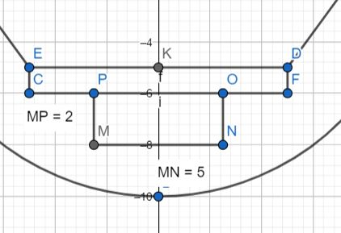

Finalmente, encima de la base se colocarán los diferentes componentes Hardware de manera estratégica.

Las ruedas se conectarán a los motores mediante un sistema de poleas. El diseño de las piezas 3D se incluye en la carpeta piezas, y en el archivo Esquema3d.dwg se ha incluido un modelo 3D del esquema de colocación de las piezas que aquí se ha explicado.

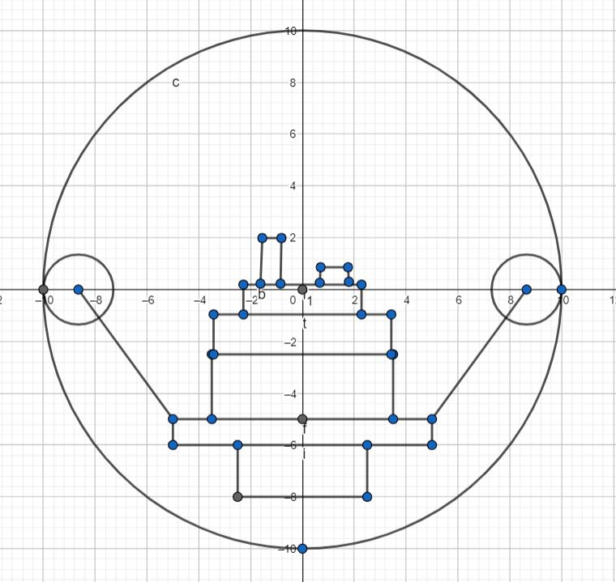

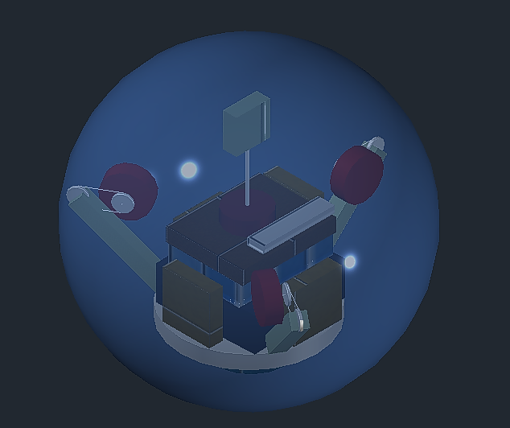

<div id='esqHW'/>

### Esquema Hardware
El esquema de conexión entre los diferentes componentes hardware es el siguiente

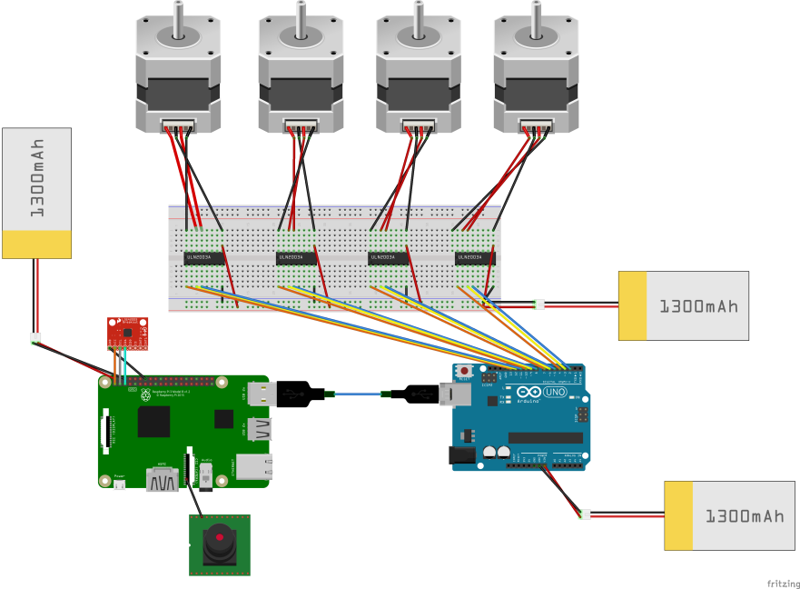

<div id='software'/>

## Arquitectura Software
Se han identificado los diferentes módulos software

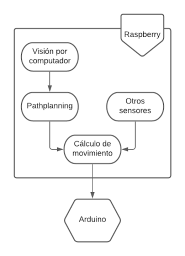

<div id='VC'/>

### Visión por computador

Este módulo será el encargado de interpretar las imágenes que entren como input desde la cámara. Aquí se efectuará la obtención de datos a partir de las imágenes.
 
Se hará uso de un modelo entrenado de redes neuronales capaz de reconocer al animal doméstico y, mediante procesamiento de imagen, de posicionarlo en el espacio. Además reconocerá también obstáculos que haya en el camino para, una vez identificado todo, pasar esta información al módulo de pathplanning.

Para lograrlo, se hará uso de las librerías Python OpenCV (para la captación y procesamiento de la imagen) y Keras (para el uso de modelos de inteligencia artificial). 
Este módulo se puede dividir en dos detectores diferentes, el detector de obstáculos y el detector concreto.

<div id='detectObst'/>

#### Detector de obstáculos
El detector de obstáculos tendrá la función de identificar obstáculos que el robot pueda encontrar en su camino y extraer información de estos, como puede ser la distancia o la posición de estos.

Se ha optado por un enfoque en el que se ha usado un algoritmo de Dense Optical Flow. Así pues, el algoritmo de visión del MVP aplica el algoritmo de Optical Flow sobre el frame anterior y el actual y aprovecha las magnitudes devueltas a las que aplica un threshold y, por último, un closing para eliminar posible ruido y unir algunas partes que pudieran quedar sueltas. La máscara resultante es la que se devolverá y se usará para el pathplanning. Este proceso queda reflejado en el siguiente diagrama.

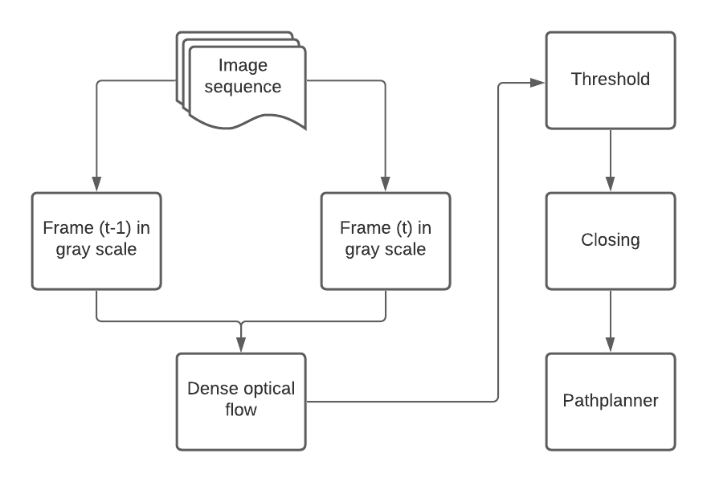

Por otro lado, en la siguiente imagen se puede observar un ejemplo de máscara devuelta.


<div id='detectorConcr'/>

#### Detector concreto
El detector concreto se encargará de identificar objetos clave, en nuestro caso la mascota de la que tendrá que huir. Igual que el detector de obstáculos, también devolverá información de estos objetos, en este caso, la bounding box.
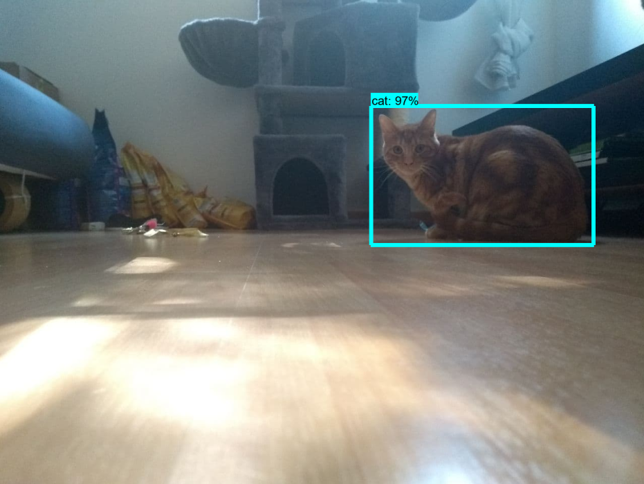

<div id='pathpl'/>

### Path-planning
Este módulo será el que se encargue de procesar el mapa generado por el módulo de visión por computador, teniendo en cuenta la localización de la mascota y de los obstáculos. Trazará una ruta que será ejecutada mediante el movimiento de los motores internos del robot. 

Se seguirá una estrategia greedy para trazar una ruta puesto que no se contará con el mapeo del entorno. El algoritmo trabajará únicamente con la información recibida por el módulo de visión, con la que podrá hacer una mínima planificación de una posible ruta a seguir, aunque esta podrá ser modificada mientras se recorre (debido a imprevistos).

El algoritmo ha sido programado por el equipo íntegramente, tomando como referencia algoritmos de búsqueda local.

En definitiva, se ha definido una máquina de estados finitos que define la personalidad del robot.

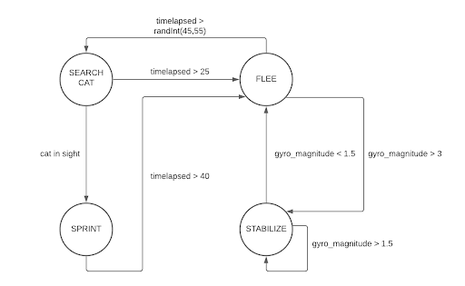

La máquina cuenta con 4 estados: FLEE, STABILIZE, SEARCH CAT y SPRINT. En el primer estado, el robot correrá libremente esquivando obstáculos y paredes durante unos segundos. Una vez transcurridos estos segundos, se parará para buscar al gato (estado SEARCH CAT). Más adelante se explicará en profundidad la parte fundamental del algoritmo de esquiva de obstáculos. El segundo estado para los motores y espera a que las lecturas del giroscopio se normalicen, para ello se calcula la la magnitud del vector de lectura y se compara con un threshold (tal y como se puede observar en la imagen anterior). El tercer estado da la orden de parar motores y rota la cámara hasta dar con el gato. Si este no estuviera en su rango de visión y transcurridos unos segundos el robot volvería al estado de FLEE. En caso contrario, entra en estado de SPRINT, el cual ejecuta el mismo algoritmo que el estado FLEE pero multiplicando por un factor la velocidad de movimiento y de rotación emulando una reacción exagerada. De esta manera, el robot adquiere una personalidad que llamará la atención de los gatos y la mantendrá.

El algoritmo de esquiva de obstáculos toma la máscara devuelta por el módulo de visión y crea un vector con el índice máximo en el que hay un valor diferente de 0 de cada columna. Este vector simboliza una línea del horizonte. Entonces, hace un sumatorio a partir de cada valor del vector ponderado por la distancia respecto al límite superior de la imagen y al centro en el eje horizontal. El resultado de este valor marcará en qué dirección y con qué velocidad deberá girar el robot. El algoritmo también calcula la velocidad de movimiento a partir de la diferencia del ancho de la imagen entre la media de los valores del vector y un threshold. De esta manera, cuanto más cercana al robot sea la línea del horizonte, más despacio irá para poder maniobrar mejor.

<div id='otrosSens'/>

### Otros sensores
Este módulo controlará los datos del giroscopio/acelerómetro y los traducirá a órdenes sobre los tres motores internos. Los datos extraídos serán trasladados a información necesaria para que el robot pueda mantenerse erguido, cosa que se considera de fundamental importancia ya que así la cámara podrá extraer datos más precisos.

Los sensores estarán conectados a la raspberry, en la cual se usará la librería mpu6050-raspberrypi 1.1 para leer los valores del giroscopio/acelerómetro.

<div id='calcMov'/>

### Cálculo de movimiento
A partir de la dirección recibida por el módulo de pathplanning y la información de los demás sensores, este módulo calculará con precisión el próximo movimiento y fuerza a aplicar en los motores. Este buscará, en la medida de lo posible, seguir el camino trazado por el pathplanner y mantener estable la estructura interna del robot.

<div id='arduino'/>

### Arduino

Este módulo hará de actuador y enviará las señales a los motores mediante la librería stepper.

<div id='sim'/>

## Simulación

La simulación se ha llevado a cabo en el simulador Webots, dado que se trata de un simulador con un motor de físicas suficientemente complejo como para simular el robot.  El primer objetivo ha sido crear el modelo 3D y modelar las funciones de movimiento del robot a partir del movimiento de las ruedas, teniendo en cuenta todos los factores físicos  posibles (inercia, fricción, gravedad, etc.) tal y como ocurriría en la vida real.

Posteriormente, se ha generardo un entorno realista basado en una vivienda amueblada donde el modelo definido ha sido testeado. Así, se pueden ver las interacciones con los obstáculos estáticos y, también,  con los dinámicos.  La simulación mostrará en todo momento  un punto de vista desde el que se pueda ver la bola por la parte de atrás.

El modelo del robot simulado cuenta con una carcasa, 3 motores rotacionales y un cilindro que actúa como centro de masas. El robot se puede controlar mediante el teclado enviando instrucciones directamente a cada uno de los motores con los que cuenta, o bien de manera automática.

Se ha escrito un plugin para el simulador que calcula la velocidad angular de la esfera a partir de las velocidades de las tres ruedas utilizando la siguiente fórmula.

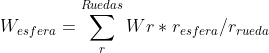

Finalmente, se ha añadido un gato montado en un robot móvil que se irá moviendo por el entorno para que el juguetron pueda detectarlo.

Se puede ver un vídeo que muestra la simulación en el siguiente link
https://www.youtube.com/watch?v=o8pFeoxQk68

<div id='autores'/>

## Autores
Iván Lorenzo Alcaina

Pablo Chen

Biel Castaño Segade

Sergi Masip Cabeza

Este proyecto se ha realizado para la asignatura Robótica, Lenguaje y Programación, de la mención de computación de Ingenieria informática por la Universidad Autónoma de Barcelona.
